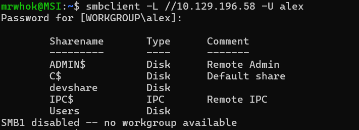

# HTB Academy - Footprinting Write-up

### Table of Contents
1. [FTP](#ftp)
2. [SMB](#smb)
3. [NFS](#nfs)
4. [DNS](#dns)
5. [SMTP](#smtp)
6. [IMAP/POP3](#imappop3)
7. [SNMP](#snmp)
8. [MySQL](#mysql)
9. [MSSQL](#mssql)
10. [Oracle-TNS](#oracle-tns)
11. [IPMI](#ipmi)
12. [Footprinting Lab - Easy](#footprinting-lab---easy)
13. [Footprinting Lab - Medium](#footprinting-lab---medium)

---
# FTP
1. Which version of the FTP server is running on the target system? Submit the entire banner as the answer.

    To solve this i tried using nmap -sV but the result was disorganized. So i changed to use ncat. 

    ```cmd
    ncat -nv 10.129.144.15 21
    ```

2. Enumerate the FTP server and find the flag.txt file. Submit the contents of it as the answer.

    To solve this, we just need to use ftp. Here the flow.
    ```cmd
    C:\Users\Aydin>ftp 10.129.144.15
    Connected to 10.129.144.15.
    220 InFreight FTP v1.1
    200 UTF8 set to on
    User (10.129.144.15:(none)): anonymous
    331 Anonymous login ok, send your complete email address as your password
    Password:

    230 Anonymous access granted, restrictions apply
    ftp> ls
    200 PORT command successful
    150 Opening ASCII mode data connection for file list
    flag.txt
    226 Transfer complete
    ftp: 13 bytes received in 0.01Seconds 0.93Kbytes/sec.
    ftp> get flag.txt
    200 PORT command successful
    150 Opening ASCII mode data connection for flag.txt (39 bytes)
    226 Transfer complete
    ftp: 40 bytes received in 0.00Seconds 13.33Kbytes/sec.
    ftp> quit
    221 Goodbye.
    ```
# SMB
1. What version of the SMB server is running on the target system? Submit the entire banner as the answer.

    We can scan common ports for SMB which is 139 and 445
    ```bash
    nmap -sV -sC -p139,445 10.129.144.15
    ```
2. What is the name of the accessible share on the target?
    
    We can solve it by connect to the smb. 
    ```bash
    smbclient -N -L 10.129.144.15
    ```

    Here the details result
    ```bash
    mrwhok@MSI:~/ctf/HTB-Academy$ smbclient -N -L 10.129.144.15

        Sharename       Type      Comment
        ---------       ----      -------
        print$          Disk      Printer Drivers
        sambashare      Disk      InFreight SMB v3.1
        IPC$            IPC       IPC Service (InlaneFreight SMB server (Samba, Ubuntu))
    SMB1 disabled -- no workgroup available
    ```
3. Connect to the discovered share and find the flag.txt file. Submit the contents as the answer.

    The previous answer is sambashare, so we try to access it now.
    ```bash
    smbclient //10.129.144.15/sambashare
    ```

    Here the details result.
    ```bash
    mrwhok@MSI:~/ctf/HTB-Academy$ smbclient //10.129.144.15/sambashare
    Password for [WORKGROUP\mrwhok]:
    Try "help" to get a list of possible commands.
    smb: \> ls
    .                                   D        0  Mon Nov  8 20:43:14 2021
    ..                                  D        0  Mon Nov  8 22:53:19 2021
    .profile                            H      807  Tue Feb 25 19:03:22 2020
    contents                            D        0  Mon Nov  8 20:43:45 2021
    .bash_logout                        H      220  Tue Feb 25 19:03:22 2020
    .bashrc                             H     3771  Tue Feb 25 19:03:22 2020

                    4062912 blocks of size 1024. 506164 blocks available
    smb: \> cd contents
    smb: \contents\> ls
    .                                   D        0  Mon Nov  8 20:43:45 2021
    ..                                  D        0  Mon Nov  8 20:43:14 2021
    flag.txt                            N       38  Mon Nov  8 20:43:45 2021

                    4062912 blocks of size 1024. 506164 blocks available
    smb: \contents\> get flag.txt
    getting file \contents\flag.txt of size 38 as flag.txt (0.0 KiloBytes/sec) (average 0.0 KiloBytes/sec)
    smb: \contents\> !cat flag.txt
    HTB{o873nz4xdo873n4zo873zn4fksuhldsf}
    ```

4. Find out which domain the server belongs to.

    To solve this, i used rpcclient. Domain name means in here is the name of the network groups it belong to. Here my command.
    ```bash
    rpcclient -U "" 10.129.144.15
    ```
    ```bash
    rpcclient $> querydominfo
    ```
    Here the detail result.
    ```bash
    mrwhok@MSI:~/ctf/HTB-Academy$ rpcclient -U "" 10.129.144.15
    Password for [WORKGROUP\]:
    rpcclient $> srvinfo
            DEVSMB         Wk Sv PrQ Unx NT SNT InlaneFreight SMB server (Samba, Ubuntu)
            platform_id     :       500
            os version      :       6.1
            server type     :       0x809a03
    rpcclient $> enumdomains
    name:[DEVSMB] idx:[0x0]
    name:[Builtin] idx:[0x1]
    rpcclient $> querydominfo
    Domain:         DEVOPS
    Server:         DEVSMB
    Comment:        InlaneFreight SMB server (Samba, Ubuntu)
    Total Users:    0
    Total Groups:   0
    Total Aliases:  0
    Sequence No:    1757952540
    Force Logoff:   -1
    Domain Server State:    0x1
    Server Role:    ROLE_DOMAIN_PDC
    Unknown 3:      0x1
    rpcclient $>
    ```
5. Find additional information about the specific share we found previously and submit the customized version of that specific share as the answer.

    We can submit remark result by using this command.

    ```bash
    rpcclient $> netsharegetinfo sambashare
    ```

6. What is the full system path of that specific share? (format: "/directory/names")

    We can use previous command result and submit the path.


# NFS
1. Enumerate the NFS service and submit the contents of the flag.txt in the "nfs" share as the answer.

    We can solve this just by login in.
    ```bash
    sudo mount -t nfs 10.129.75.222:/ ./target-nfs/ -o nolock
    ```
    Here the tree result.
    ```bash
    mrwhok@MSI:/tmp/target-nfs$ tree
    .
    ├── mnt
    │   └── nfsshare
    │       └── flag.txt
    └── var
        └── nfs
            └── flag.txt

    5 directories, 2 files
    ```
2. Enumerate the NFS service and submit the contents of the flag.txt in the "nfsshare" share as the answer.

    We can solve by changing the directory

# DNS

    There are several ways to attack DNS. Here the list.
    - https://www.cvedetails.com/product/144/ISC-Bind.html?vendor_id=64
    - https://web.archive.org/web/20250329174745/https://securitytrails.com/blog/most-popular-types-dns-attacks

## Tools
1. dnsenum
2. dig

## Challenges
1. Interact with the target DNS using its IP address and enumerate the FQDN of it for the "inlanefreight.htb" domain.
    I tried to use this command for the first step and get the result. 
    ```bash
    dig axfr inlanefreight.htb @10.129.168.24
    ```
    Here the output.
    ```bash
    mrwhok@MSI:~$ dig axfr inlanefreight.htb @10.129.168.24

    ; <<>> DiG 9.18.39-0ubuntu0.24.04.1-Ubuntu <<>> axfr inlanefreight.htb @10.129.168.24
    ;; global options: +cmd
    inlanefreight.htb.      604800  IN      SOA     inlanefreight.htb. root.inlanefreight.htb. 2 604800 86400 2419200 604800
    inlanefreight.htb.      604800  IN      TXT     "MS=ms97310371"
    inlanefreight.htb.      604800  IN      TXT     "atlassian-domain-verification=t1rKCy68JFszSdCKVpw64A1QksWdXuYFUeSXKU"
    inlanefreight.htb.      604800  IN      TXT     "v=spf1 include:mailgun.org include:_spf.google.com include:spf.protection.outlook.com include:_spf.atlassian.net ip4:10.129.124.8 ip4:10.129.127.2 ip4:10.129.42.106 ~all"
    inlanefreight.htb.      604800  IN      NS      ns.inlanefreight.htb.
    app.inlanefreight.htb.  604800  IN      A       10.129.18.15
    dev.inlanefreight.htb.  604800  IN      A       10.12.0.1
    internal.inlanefreight.htb. 604800 IN   A       10.129.1.6
    mail1.inlanefreight.htb. 604800 IN      A       10.129.18.201
    ns.inlanefreight.htb.   604800  IN      A       127.0.0.1
    inlanefreight.htb.      604800  IN      SOA     inlanefreight.htb. root.inlanefreight.htb. 2 604800 86400 2419200 604800
    ;; Query time: 368 msec
    ;; SERVER: 10.129.168.24#53(10.129.168.24) (TCP)
    ;; WHEN: Wed Sep 17 21:03:32 +07 2025
    ;; XFR size: 11 records (messages 1, bytes 560)
    ```

2. Identify if its possible to perform a zone transfer and submit the TXT record as the answer. (Format: HTB{...})
    From the previous, internal.inlanefreight.htb is avaliable. So in here, i tried this command. 
    ```bash
    dig axfr internal.inlanefreight.htb @10.129.168.24
    ```
    and get this result,
    ```bash
    mrwhok@MSI:~$ dig axfr internal.inlanefreight.htb @10.129.168.24

    ; <<>> DiG 9.18.39-0ubuntu0.24.04.1-Ubuntu <<>> axfr internal.inlanefreight.htb @10.129.168.24
    ;; global options: +cmd
    internal.inlanefreight.htb. 604800 IN   SOA     inlanefreight.htb. root.inlanefreight.htb. 2 604800 86400 2419200 604800
    internal.inlanefreight.htb. 604800 IN   TXT     "MS=ms97310371"
    internal.inlanefreight.htb. 604800 IN   TXT     "HTB{DN5_z0N3_7r4N5F3r_iskdufhcnlu34}"
    internal.inlanefreight.htb. 604800 IN   TXT     "atlassian-domain-verification=t1rKCy68JFszSdCKVpw64A1QksWdXuYFUeSXKU"
    internal.inlanefreight.htb. 604800 IN   TXT     "v=spf1 include:mailgun.org include:_spf.google.com include:spf.protection.outlook.com include:_spf.atlassian.net ip4:10.129.124.8 ip4:10.129.127.2 ip4:10.129.42.106 ~all"
    internal.inlanefreight.htb. 604800 IN   NS      ns.inlanefreight.htb.
    dc1.internal.inlanefreight.htb. 604800 IN A     10.129.34.16
    dc2.internal.inlanefreight.htb. 604800 IN A     10.129.34.11
    mail1.internal.inlanefreight.htb. 604800 IN A   10.129.18.200
    ns.internal.inlanefreight.htb. 604800 IN A      127.0.0.1
    vpn.internal.inlanefreight.htb. 604800 IN A     10.129.1.6
    ws1.internal.inlanefreight.htb. 604800 IN A     10.129.1.34
    ws2.internal.inlanefreight.htb. 604800 IN A     10.129.1.35
    wsus.internal.inlanefreight.htb. 604800 IN A    10.129.18.2
    internal.inlanefreight.htb. 604800 IN   SOA     inlanefreight.htb. root.inlanefreight.htb. 2 604800 86400 2419200 604800
    ;; Query time: 345 msec
    ;; SERVER: 10.129.168.24#53(10.129.168.24) (TCP)
    ;; WHEN: Wed Sep 17 20:40:36 +07 2025
    ;; XFR size: 15 records (messages 1, bytes 677)
    ```
3. What is the IPv4 address of the hostname DC1?
    From the previous output, the naswer is 10.129.34.16

4. What is the FQDN of the host where the last octet ends with "x.x.x.203"?
    To solve this, we need to find all zones. After that, each zone we have already find, we use this command. In this case, the right zone is dev.
    
    ```bash
    dnsenum --dnsserver 10.129.168.24 --enum -p 0 -s 0 -o subdomains.txt -f /home/mrwhok/tools/SecLists/Discovery/DNS/subdomains-top1million-5000.txt --threads 90 dev.inlanefreight.htb
    ```

    Here the output.
    ```bash
    mrwhok@MSI:~/ctf/HTB-Academy/footprinting$ dnsenum --dnsserver 10.129.168.24 --enum -p 0 -s 0 -o subdomains.txt -f /home/mrwhok/tools/SecLists/Discovery/DNS/subdomains-top1million-5000.txt --threads 90 dev.inlanefreight.htb
    dnsenum VERSION:1.2.6

    -----   dev.inlanefreight.htb   -----


    Host's addresses:
    __________________


    Name Servers:
    ______________

    ns.inlanefreight.htb.                    604800   IN    A         127.0.0.1


    Mail (MX) Servers:
    ___________________


    Trying Zone Transfers and getting Bind Versions:
    _________________________________________________

    unresolvable name: ns.inlanefreight.htb at /usr/bin/dnsenum line 897 thread 2.

    Trying Zone Transfer for dev.inlanefreight.htb on ns.inlanefreight.htb ...
    AXFR record query failed: no nameservers


    Brute forcing with /home/mrwhok/tools/SecLists/Discovery/DNS/subdomains-top1million-5000.txt:
    ______________________________________________________________________________________________

    win2k.dev.inlanefreight.htb.             604800   IN    A        10.12.3.203
    ns.dev.inlanefreight.htb.                604800   IN    A         127.0.0.1
    ^C
    mrwhok@MSI:~/ctf/HTB-Academy/footprinting$
    ```

# SMTP
## Port
- 25
## Challenges
1. Enumerate the SMTP service and submit the banner, including its version as the answer.
    We can solve this using nmap.
    ```bash
    nmap 10.129.42.195 -sC -sV -p25
    ```

    Here the result.
    
    ```bash
    mrwhok@MSI:~/ctf/HTB-Academy/footprinting$ nmap 10.129.42.195 -sC -sV -p25
    Starting Nmap 7.94SVN ( https://nmap.org ) at 2025-09-17 22:53 +07
    Nmap scan report for 10.129.42.195
    Host is up (0.51s latency).

    PORT   STATE SERVICE VERSION
    25/tcp open  smtp
    | fingerprint-strings:
    |   Hello:
    |     220 InFreight ESMTP v2.11
    |     Syntax: EHLO hostname
    |   Help, NULL:
    |_    220 InFreight ESMTP v2.11
    |_smtp-commands: mail1, PIPELINING, SIZE 10240000, VRFY, ETRN, STARTTLS, ENHANCEDSTATUSCODES, 8BITMIME, DSN, SMTPUTF8, CHUNKING
    1 service unrecognized despite returning data. If you know the service/version, please submit the following fingerprint at https://nmap.org/cgi-bin/submit.cgi?new-service :
    SF-Port25-TCP:V=7.94SVN%I=7%D=9/17%Time=68CAD972%P=x86_64-pc-linux-gnu%r(N
    SF:ULL,1B,"220\x20InFreight\x20ESMTP\x20v2\.11\r\n")%r(Hello,36,"220\x20In
    SF:Freight\x20ESMTP\x20v2\.11\r\n501\x20Syntax:\x20EHLO\x20hostname\r\n")%
    SF:r(Help,1B,"220\x20InFreight\x20ESMTP\x20v2\.11\r\n");

    Service detection performed. Please report any incorrect results at https://nmap.org/submit/ .
    Nmap done: 1 IP address (1 host up) scanned in 80.98 seconds
    ```
2. Enumerate the SMTP service even further and find the username that exists on the system. Submit it as the answer.
    To solve this, i used metasploit. First open metasploit then i do this.
    ```bash
    msf > use auxiliary/scanner/smtp/smtp_enum
    msf auxiliary(scanner/smtp/smtp_enum) > set RHOSTS 10.129.42.195
    msf auxiliary(scanner/smtp/smtp_enum) > set USER_FILE footprinting-wordlist.txt
    msf auxiliary(scanner/smtp/smtp_enum) > run
    ```
    and here the output. 
    
    ```bash
    msf auxiliary(scanner/smtp/smtp_enum) > run
    [*] 10.129.42.195:25      - 10.129.42.195:25 Banner: 220 InFreight ESMTP v2.11
    [+] 10.129.42.195:25      - 10.129.42.195:25 Users found: robin
    [*] 10.129.42.195:25      - Scanned 1 of 1 hosts (100% complete)
    [*] Auxiliary module execution completed
    ```

# IMAP/POP3
## Port
- 110
- 143
- 993
- 995
## Tools
- openssl
- nmap (for enumaration)

## Challenges
1. Figure out the exact organization name from the IMAP/POP3 service and submit it as the answer.
    
    We can solve this by using nmap and check ports for imap/pop3. Here my commands.
    ```bash
    nmap -sV -sC -p110,143,993,995 10.129.36.250
    ```
    Here the output.
    ```bash
    mrwhok@MSI:~$ nmap -sV -sC -p110,143,993,995 10.129.36.250
    Starting Nmap 7.94SVN ( https://nmap.org ) at 2025-09-18 13:30 +07
    Nmap scan report for 10.129.36.250
    Host is up (0.42s latency).

    PORT    STATE SERVICE  VERSION
    110/tcp open  pop3     Dovecot pop3d
    |_pop3-capabilities: TOP RESP-CODES AUTH-RESP-CODE STLS CAPA SASL UIDL PIPELINING
    |_ssl-date: TLS randomness does not represent time
    | ssl-cert: Subject: commonName=dev.inlanefreight.htb/organizationName=InlaneFreight Ltd/stateOrProvinceName=London/countryName=UK
    | Not valid before: 2021-11-08T23:10:05
    |_Not valid after:  2295-08-23T23:10:05
    143/tcp open  imap     Dovecot imapd
    | ssl-cert: Subject: commonName=dev.inlanefreight.htb/organizationName=InlaneFreight Ltd/stateOrProvinceName=London/countryName=UK
    | Not valid before: 2021-11-08T23:10:05
    |_Not valid after:  2295-08-23T23:10:05
    |_imap-capabilities: LITERAL+ ID IDLE have LOGINDISABLEDA0001 capabilities Pre-login post-login ENABLE LOGIN-REFERRALS SASL-IR listed OK IMAP4rev1 more STARTTLS
    |_ssl-date: TLS randomness does not represent time
    993/tcp open  ssl/imap Dovecot imapd
    |_ssl-date: TLS randomness does not represent time
    |_imap-capabilities: AUTH=PLAINA0001 ID IDLE LITERAL+ have capabilities post-login ENABLE LOGIN-REFERRALS SASL-IR listed Pre-login OK more IMAP4rev1
    | ssl-cert: Subject: commonName=dev.inlanefreight.htb/organizationName=InlaneFreight Ltd/stateOrProvinceName=London/countryName=UK
    | Not valid before: 2021-11-08T23:10:05
    |_Not valid after:  2295-08-23T23:10:05
    995/tcp open  ssl/pop3 Dovecot pop3d
    | ssl-cert: Subject: commonName=dev.inlanefreight.htb/organizationName=InlaneFreight Ltd/stateOrProvinceName=London/countryName=UK
    | Not valid before: 2021-11-08T23:10:05
    |_Not valid after:  2295-08-23T23:10:05
    |_ssl-date: TLS randomness does not represent time
    |_pop3-capabilities: TOP RESP-CODES AUTH-RESP-CODE SASL(PLAIN) CAPA USER UIDL PIPELINING

    Service detection performed. Please report any incorrect results at https://nmap.org/submit/ .
    Nmap done: 1 IP address (1 host up) scanned in 29.21 seconds
    mrwhok@MSI:~$
    ```
2. What is the FQDN that the IMAP and POP3 servers are assigned to?

    We can use the previous output to answer this.

3. Enumerate the IMAP service and submit the flag as the answer. (Format: HTB{...})

    We can solve this using curl for specific user in IMAP service. We can get username and password from the module.
    
    ```bash
    curl -k 'imaps://10.129.36.250' --user robin:robin -v
    ```

    Here the output.

    ```bash
    mrwhok@MSI:~$ curl -k 'imaps://10.129.36.250' --user robin:robin -v
    *   Trying 10.129.36.250:993...
    * Connected to 10.129.36.250 (10.129.36.250) port 993
    * TLSv1.3 (OUT), TLS handshake, Client hello (1):
    * TLSv1.3 (IN), TLS handshake, Server hello (2):
    * TLSv1.3 (IN), TLS handshake, Encrypted Extensions (8):
    * TLSv1.3 (IN), TLS handshake, Certificate (11):
    * TLSv1.3 (IN), TLS handshake, CERT verify (15):
    * TLSv1.3 (IN), TLS handshake, Finished (20):
    * TLSv1.3 (OUT), TLS change cipher, Change cipher spec (1):
    * TLSv1.3 (OUT), TLS handshake, Finished (20):
    * SSL connection using TLSv1.3 / TLS_AES_256_GCM_SHA384 / X25519 / RSASSA-PSS
    * Server certificate:
    *  subject: C=UK; ST=London; L=London; O=InlaneFreight Ltd; OU=DevOps Dep�artment; CN=dev.inlanefreight.htb; emailAddress=cto.dev@dev.inlanefreight.htb
    *  start date: Nov  8 23:10:05 2021 GMT
    *  expire date: Aug 23 23:10:05 2295 GMT
    *  issuer: C=UK; ST=London; L=London; O=InlaneFreight Ltd; OU=DevOps Dep�artment; CN=dev.inlanefreight.htb; emailAddress=cto.dev@dev.inlanefreight.htb
    *  SSL certificate verify result: self-signed certificate (18), continuing anyway.
    *   Certificate level 0: Public key type RSA (2048/112 Bits/secBits), signed using sha256WithRSAEncryption
    * TLSv1.3 (IN), TLS handshake, Newsession Ticket (4):
    * TLSv1.3 (IN), TLS handshake, Newsession Ticket (4):
    * old SSL session ID is stale, removing
    < * OK [CAPABILITY IMAP4rev1 SASL-IR LOGIN-REFERRALS ID ENABLE IDLE LITERAL+ AUTH=PLAIN] HTB{roncfbw7iszerd7shni7jr2343zhrj}
    > A001 CAPABILITY
    < * CAPABILITY IMAP4rev1 SASL-IR LOGIN-REFERRALS ID ENABLE IDLE LITERAL+ AUTH=PLAIN
    < A001 OK Pre-login capabilities listed, post-login capabilities have more.
    > A002 AUTHENTICATE PLAIN AHJvYmluAHJvYmlu
    < * CAPABILITY IMAP4rev1 SASL-IR LOGIN-REFERRALS ID ENABLE IDLE SORT SORT=DISPLAY THREAD=REFERENCES THREAD=REFS THREAD=ORDEREDSUBJECT MULTIAPPEND URL-PARTIAL CATENATE UNSELECT CHILDREN NAMESPACE UIDPLUS LIST-EXTENDED I18NLEVEL=1 CONDSTORE QRESYNC ESEARCH ESORT SEARCHRES WITHIN CONTEXT=SEARCH LIST-STATUS BINARY MOVE SNIPPET=FUZZY PREVIEW=FUZZY LITERAL+ NOTIFY SPECIAL-USE
    < A002 OK Logged in
    > A003 LIST "" *
    < * LIST (\Noselect \HasChildren) "." DEV
    * LIST (\Noselect \HasChildren) "." DEV
    < * LIST (\Noselect \HasChildren) "." DEV.DEPARTMENT
    * LIST (\Noselect \HasChildren) "." DEV.DEPARTMENT
    < * LIST (\HasNoChildren) "." DEV.DEPARTMENT.INT
    * LIST (\HasNoChildren) "." DEV.DEPARTMENT.INT
    < * LIST (\HasNoChildren) "." INBOX
    * LIST (\HasNoChildren) "." INBOX
    < A003 OK List completed (0.008 + 0.000 + 0.007 secs).
    * Connection #0 to host 10.129.36.250 left intact
    ```
4. What is the customized version of the POP3 server?
    
    We can get the POP3 server using openssl. Here the commands.

    ```bash
    openssl s_client -connect 10.129.36.250:pop3s
    ```
    Here the output.

    ```bash
    mrwhok@MSI:~$ openssl s_client -connect 10.129.36.250:pop3s
    CONNECTED(00000003)
    Can't use SSL_get_servername
    depth=0 C = UK, ST = London, L = London, O = InlaneFreight Ltd, OU = DevOps Dep\C3\83artment, CN = dev.inlanefreight.htb, emailAddress = cto.dev@dev.inlanefreight.htb
    verify error:num=18:self-signed certificate
    verify return:1
    depth=0 C = UK, ST = London, L = London, O = InlaneFreight Ltd, OU = DevOps Dep\C3\83artment, CN = dev.inlanefreight.htb, emailAddress = cto.dev@dev.inlanefreight.htb
    verify return:1
    ---
    Certificate chain
    0 s:C = UK, ST = London, L = London, O = InlaneFreight Ltd, OU = DevOps Dep\C3\83artment, CN = dev.inlanefreight.htb, emailAddress = cto.dev@dev.inlanefreight.htb
    i:C = UK, ST = London, L = London, O = InlaneFreight Ltd, OU = DevOps Dep\C3\83artment, CN = dev.inlanefreight.htb, emailAddress = cto.dev@dev.inlanefreight.htb
    a:PKEY: rsaEncryption, 2048 (bit); sigalg: RSA-SHA256
    v:NotBefore: Nov  8 23:10:05 2021 GMT; NotAfter: Aug 23 23:10:05 2295 GMT
    ---
    Server certificate
    -----BEGIN CERTIFICATE-----
    MIIEUzCCAzugAwIBAgIUDf35PqFuv6Uv0EECM8dFmNSZoY8wDQYJKoZIhvcNAQEL
    BQAwgbcxCzAJBgNVBAYTAlVLMQ8wDQYDVQQIDAZMb25kb24xDzANBgNVBAcMBkxv
    bmRvbjEaMBgGA1UECgwRSW5sYW5lRnJlaWdodCBMdGQxHDAaBgNVBAsME0Rldk9w
    cyBEZXDDg2FydG1lbnQxHjAcBgNVBAMMFWRldi5pbmxhbmVmcmVpZ2h0Lmh0YjEs
    MCoGCSqGSIb3DQEJARYdY3RvLmRldkBkZXYuaW5sYW5lZnJlaWdodC5odGIwIBcN
    MjExMTA4MjMxMDA1WhgPMjI5NTA4MjMyMzEwMDVaMIG3MQswCQYDVQQGEwJVSzEP
    MA0GA1UECAwGTG9uZG9uMQ8wDQYDVQQHDAZMb25kb24xGjAYBgNVBAoMEUlubGFu
    ZUZyZWlnaHQgTHRkMRwwGgYDVQQLDBNEZXZPcHMgRGVww4NhcnRtZW50MR4wHAYD
    VQQDDBVkZXYuaW5sYW5lZnJlaWdodC5odGIxLDAqBgkqhkiG9w0BCQEWHWN0by5k
    ZXZAZGV2LmlubGFuZWZyZWlnaHQuaHRiMIIBIjANBgkqhkiG9w0BAQEFAAOCAQ8A
    MIIBCgKCAQEAxvMwFE6m+iBUSujb5d6DUy1xDYR5awzQRwddyvq6iBrMxbnptSrn
    +j0UOKWHCOpD5LREwP26ghUg0lVJzfo+v5pQJGnxEXKg0OFlzWEd8xgx/JWW/z1/
    rDsWlNa2yYZkCy68YWJlC7UZxvcDFrI0V0pDJIkrjForw26laoYDkrh1A5F8uUXD
    1TwRLLYo+NGmtNHT3BADJpv6aFUZ4CGrqBQNi7XpsTZ948WLhUwQvWmebiK06Dai
    TvMNKBctjWAiNI4xvq34W9hIUaPxT1JJzuujRslep6nHGHW00QEWTWgyOMYThc3b
    HtKIHMfDLTUMz7s8RhVVwlWE6+ly1DMRgQIDAQABo1MwUTAdBgNVHQ4EFgQUGDTC
    9B5KCKPWT7vXbnMunL/mEE4wHwYDVR0jBBgwFoAUGDTC9B5KCKPWT7vXbnMunL/m
    EE4wDwYDVR0TAQH/BAUwAwEB/zANBgkqhkiG9w0BAQsFAAOCAQEADh0v5XWCf3KO
    atrWcoiIOC67Z0ZIO7yEF+fQo8z+Wx1dWzmCFVu7u4+l7slcdJICCGBbOX8eItWS
    chwzgnWJToyX8PWY8lSaB8ifMDQcr457Y7O6NmvgU35sRcLnYYqXzu2oh0lxsFLR
    vL1wpyDLPhhoI++j1fELhiJ3GWiUQrb0vfJPcbSkHTgzf0hm7mLJTaqt3WfS/Gr2
    8Oh7vSfzvqvHLE7HHAO0G5Q81zo+wWsrQF0s40HEF/raEMfOy2Htm79YjyjAlLWf
    ueS+u8rX2smOYdRIpL3UPx7+yZPGu47vYoetde1Z5cfTCgmeS05BQ2qMOp6Tw6+G
    xUuqg8nK1Q==
    -----END CERTIFICATE-----
    subject=C = UK, ST = London, L = London, O = InlaneFreight Ltd, OU = DevOps Dep\C3\83artment, CN = dev.inlanefreight.htb, emailAddress = cto.dev@dev.inlanefreight.htb
    issuer=C = UK, ST = London, L = London, O = InlaneFreight Ltd, OU = DevOps Dep\C3\83artment, CN = dev.inlanefreight.htb, emailAddress = cto.dev@dev.inlanefreight.htb
    ---
    No client certificate CA names sent
    Peer signing digest: SHA256
    Peer signature type: RSA-PSS
    Server Temp Key: X25519, 253 bits
    ---
    SSL handshake has read 1667 bytes and written 373 bytes
    Verification error: self-signed certificate
    ---
    New, TLSv1.3, Cipher is TLS_AES_256_GCM_SHA384
    Server public key is 2048 bit
    Secure Renegotiation IS NOT supported
    Compression: NONE
    Expansion: NONE
    No ALPN negotiated
    Early data was not sent
    Verify return code: 18 (self-signed certificate)
    ---
    ---
    Post-Handshake New Session Ticket arrived:
    SSL-Session:
        Protocol  : TLSv1.3
        Cipher    : TLS_AES_256_GCM_SHA384
        Session-ID: 2744673FF91BFE3D897D93A75FB8FB7FB5F1A47D8EBCE2DF9DA6662FE7B69B4D
        Session-ID-ctx:
        Resumption PSK: 617A9F5AEEEC11DED9A67A8F4B64C10A540E20A1C52A38CB48E01C847E57758D7614B7D0E5D3F6385377551FDF6C9073
        PSK identity: None
        PSK identity hint: None
        SRP username: None
        TLS session ticket lifetime hint: 7200 (seconds)
        TLS session ticket:
        0000 - f9 7f b4 39 8c 15 3e 3c-9e 24 d0 b7 3b ee fd 4d   ...9..><.$..;..M
        0010 - cc 47 25 39 1b c8 a5 c2-ce 3a 03 43 8e 5d 96 72   .G%9.....:.C.].r
        0020 - 28 3b bd 61 2e 76 2e 9e-90 59 48 e8 6f 51 3c 03   (;.a.v...YH.oQ<.
        0030 - 3c b7 b6 a5 76 2a b7 6b-c0 8e a0 4d a6 db 69 81   <...v*.k...M..i.
        0040 - d5 35 36 f1 a8 83 a4 ec-59 30 97 c3 4f b9 75 41   .56.....Y0..O.uA
        0050 - 9c 33 1f 06 c0 03 3a df-bf 93 23 a4 8b 06 b0 da   .3....:...#.....
        0060 - cc 0b 1c bf 92 17 61 b8-b3 09 fe a8 35 8f 06 8a   ......a.....5...
        0070 - 36 a6 ce 86 f7 ea dc ea-06 f8 e3 57 1b a2 2b 09   6..........W..+.
        0080 - 7e a5 3b 51 2e 75 ae 97-9e 17 ab 48 45 ec 9d db   ~.;Q.u.....HE...
        0090 - 37 1b af 6a 22 a9 ff 0a-68 d8 5c fe 39 6c d0 27   7..j"...h.\.9l.'
        00a0 - 85 e4 c4 1e 86 dd 00 2b-c2 a8 64 f7 56 73 55 44   .......+..d.VsUD
        00b0 - 1d 72 31 0b 88 5e 23 6c-5e e2 a0 03 6e 95 aa f2   .r1..^#l^...n...

        Start Time: 1758177887
        Timeout   : 7200 (sec)
        Verify return code: 18 (self-signed certificate)
        Extended master secret: no
        Max Early Data: 0
    ---
    read R BLOCK
    ---
    Post-Handshake New Session Ticket arrived:
    SSL-Session:
        Protocol  : TLSv1.3
        Cipher    : TLS_AES_256_GCM_SHA384
        Session-ID: 7504052937EE74D5457610C95EFCAC0F8964398268D1B0C922640D25D155F2AE
        Session-ID-ctx:
        Resumption PSK: E9FE4DBAF1C7D6D691B500175B36F21543C7FDE2F7F5B5592D7681CB6A943DD373E4690C9698D397AD5E1872EB967AE3
        PSK identity: None
        PSK identity hint: None
        SRP username: None
        TLS session ticket lifetime hint: 7200 (seconds)
        TLS session ticket:
        0000 - f9 7f b4 39 8c 15 3e 3c-9e 24 d0 b7 3b ee fd 4d   ...9..><.$..;..M
        0010 - 32 dc 4c e2 c0 33 ef a3-69 9b 60 45 2c bd d7 93   2.L..3..i.`E,...
        0020 - 54 ab ee c2 7c af 86 dd-58 7f a3 f7 24 1c 46 a1   T...|...X...$.F.
        0030 - e7 2b b2 34 f3 7b 7e ec-c5 5a 3b d5 b0 2b 06 16   .+.4.{~..Z;..+..
        0040 - 8c f9 29 b2 99 87 a5 ca-43 18 b7 6c ff 5d 47 0b   ..).....C..l.]G.
        0050 - 7b f7 86 73 4c df 53 bc-09 30 d3 c9 7d 3d 57 33   {..sL.S..0..}=W3
        0060 - c6 7a fd ae 58 ab 90 08-97 c8 37 21 6d eb cc 27   .z..X.....7!m..'
        0070 - 07 da 65 fa b1 82 1e f8-eb d9 0d 86 f7 ae 15 0d   ..e.............
        0080 - f8 00 5b eb 3e c4 95 68-16 61 3a 1c c0 66 94 32   ..[.>..h.a:..f.2
        0090 - 81 d7 ef fb ff 50 f7 36-14 55 e6 87 a2 1a 09 a8   .....P.6.U......
        00a0 - 3f 84 1d d9 65 ce 11 71-75 9f 79 2f 63 96 32 2c   ?...e..qu.y/c.2,
        00b0 - 6d e4 5b 9c 9e 80 4e 52-80 5c 88 44 a3 70 cc 9c   m.[...NR.\.D.p..

        Start Time: 1758177887
        Timeout   : 7200 (sec)
        Verify return code: 18 (self-signed certificate)
        Extended master secret: no
        Max Early Data: 0
        ---
        read R BLOCK
        +OK InFreight POP3 v9.188
    ```
5. What is the admin email address?

    In the number 3 output, we can see this.

    ```bash
        < A002 OK Logged in
        > A003 LIST "" *
        < * LIST (\Noselect \HasChildren) "." DEV
        * LIST (\Noselect \HasChildren) "." DEV
        < * LIST (\Noselect \HasChildren) "." DEV.DEPARTMENT
        * LIST (\Noselect \HasChildren) "." DEV.DEPARTMENT
        < * LIST (\HasNoChildren) "." DEV.DEPARTMENT.INT
        * LIST (\HasNoChildren) "." DEV.DEPARTMENT.INT
        < * LIST (\HasNoChildren) "." INBOX
        * LIST (\HasNoChildren) "." INBOX
    ```

    We can see the mailboxes list from user robin. DEV and DEV.DEPARTEMENT both have \Noselect. That means both of them are parent folder that cant contain email. So there are 2 options left, INBOX and DEV.DEPARTEMENT.INT. When i tried to check the INBOX folder, it doesnt contain anything.

    ```bash
    mrwhok@MSI:~$ curl -k 'imaps://10.129.36.250/INBOX;UID=1' --user 'robin:robin'
    curl: (78) Remote file not found
    ```
    Then, i tried DEV.DEPARTEMENT.INT and get the result. Here the result.

    ```bash
    mrwhok@MSI:~$ curl -k 'imaps://10.129.36.250/DEV.DEPARTMENT.INT;UID=1' --user 'robin:robin'
    Subject: Flag
    To: Robin <robin@inlanefreight.htb>
    From: CTO <devadmin@inlanefreight.htb>
    Date: Wed, 03 Nov 2021 16:13:27 +0200

    HTB{983uzn8jmfgpd8jmof8c34n7zio}
    mrwhok@MSI:~$
    ```

6. Try to access the emails on the IMAP server and submit the flag as the answer. (Format: HTB{...})
     
    The answer is already on the previous number.

# SNMP
## Tools
- smpwalk (To query OID if we know the STRING)
- onesixtyone (To find the STRING)
- braa (Bruteforce individual OID with the known STRING)

## Challenges
1. Enumerate the SNMP service and obtain the email address of the admin. Submit it as the answer
    
    First we should find the community STRING first using onesixtyone tool. Here the commands.
    ```bash
    onesixtyone -c /home/mrwhok/tools/SecLists/Discovery/SNMP/snmp.txt 10.129.39.8
    ```

    We get this output. 
    ```bash
    Scanning 1 hosts, 3219 communities
    10.129.39.8 [public] Linux NIX02 5.4.0-90-generic #101-Ubuntu SMP Fri Oct 15 20:00:55 UTC 2021 x86_64
    10.129.39.8 [public] Linux NIX02 5.4.0-90-generic #101-Ubuntu SMP Fri Oct 15 20:00:55 UTC 2021 x86_64
    ```
    Based on this, we know the STRING is `public`.

    Now we use snmpwalk to get the information based on the STRING.
    ```bash
    snmpwalk -v2c -c public 10.129.39.8
    ```
2. What is the customized version of the SNMP server?
    
    We just need to take a look on the previous output.

3. Enumerate the custom script that is running on the system and submit its output as the answer.

    Once again, just look the output on the first question. Its in HTB flag format.

# MySQL
## Port
- 3306
## Challenges
1. Enumerate the MySQL server and determine the version in use. (Format: MySQL X.X.XX)

    We can solve this by enumerate using NMAP with mysql script.
    ```bash
    sudo nmap 10.129.88.42 -sV -sC -p3306 --script mysql*
    ```

    Here the output.

    ```bash
    PORT     STATE SERVICE VERSION
    3306/tcp open  mysql   MySQL 8.0.27-0ubuntu0.20.04.1
    | mysql-info:
    |   Protocol: 10
    |   Version: 8.0.27-0ubuntu0.20.04.1
    |   Thread ID: 11
    |   Capabilities flags: 65535
    |   Some Capabilities: SwitchToSSLAfterHandshake, InteractiveClient, ConnectWithDatabase, SupportsLoadDataLocal, Speaks41ProtocolOld, LongColumnFlag, LongPassword, SupportsTransactions, Speaks41ProtocolNew, IgnoreSigpipes, Support41Auth, IgnoreSpaceBeforeParenthesis, SupportsCompression, DontAllowDatabaseTableColumn, FoundRows, ODBCClient, SupportsMultipleResults, SupportsMultipleStatments, SupportsAuthPlugins
    |   Status: Autocommit
    |   Salt: 77\x08\x0ClI!.o^\x11H\x13\x08\x0Ew@\x06K8
    |_  Auth Plugin Name: caching_sha2_password
    | mysql-enum:
    |   Accounts: No valid accounts found
    |_  Statistics: Performed 9 guesses in 5 seconds, average tps: 1.8
    | mysql-brute:
    |   Accounts: No valid accounts found
    |_  Statistics: Performed 11519 guesses in 600 seconds, average tps: 18.9

    Service detection performed. Please report any incorrect results at https://nmap.org/submit/ .
    Nmap done: 1 IP address (1 host up) scanned in 608.03 seconds
    ```
2. During our penetration test, we found weak credentials "robin:robin". We should try these against the MySQL server. What is the email address of the customer "Otto Lang"?

    Based on the question we can login using robin:robin. Then we can explore the database. Here commands for login.

    ```bash
    mysql -u robin -probin -h 10.129.88.42
    ```

    Here the output.

    ```bash
    mysql: [Warning] Using a password on the command line interface can be insecure.
    Welcome to the MySQL monitor.  Commands end with ; or \g.
    Your MySQL connection id is 370
    Server version: 8.0.27-0ubuntu0.20.04.1 (Ubuntu)

    Copyright (c) 2000, 2025, Oracle and/or its affiliates.

    Oracle is a registered trademark of Oracle Corporation and/or its
    affiliates. Other names may be trademarks of their respective
    owners.

    Type 'help;' or '\h' for help. Type '\c' to clear the current input statement.

    mysql> show databases
        -> ^C
    mysql> show databases;
    +--------------------+
    | Database           |
    +--------------------+
    | customers          |
    | information_schema |
    | mysql              |
    | performance_schema |
    | sys                |
    +--------------------+
    5 rows in set (0.36 sec)

    mysql> uses customers
        -> ^C
    mysql> uses customers;
    ERROR 1064 (42000): You have an error in your SQL syntax; check the manual that corresponds to your MySQL server version for the right syntax to use near 'uses customers' at line 1
    mysql> use customers;
    Reading table information for completion of table and column names
    You can turn off this feature to get a quicker startup with -A

    Database changed
    mysql> show tables;
    +---------------------+
    | Tables_in_customers |
    +---------------------+
    | myTable             |
    +---------------------+
    1 row in set (0.36 sec)

    mysql> show columns from customers;
    ERROR 1146 (42S02): Table 'customers.customers' doesn't exist
    mysql> show columns from myTable;
    +-----------+--------------------+------+-----+---------+----------------+
    | Field     | Type               | Null | Key | Default | Extra          |
    +-----------+--------------------+------+-----+---------+----------------+
    | id        | mediumint unsigned | NO   | PRI | NULL    | auto_increment |
    | name      | varchar(255)       | YES  |     | NULL    |                |
    | email     | varchar(255)       | YES  |     | NULL    |                |
    | country   | varchar(100)       | YES  |     | NULL    |                |
    | postalZip | varchar(20)        | YES  |     | NULL    |                |
    | city      | varchar(255)       | YES  |     | NULL    |                |
    | address   | varchar(255)       | YES  |     | NULL    |                |
    | pan       | varchar(255)       | YES  |     | NULL    |                |
    | cvv       | varchar(255)       | YES  |     | NULL    |                |
    +-----------+--------------------+------+-----+---------+----------------+
    9 rows in set (0.36 sec)

    mysql> select email from myTable where name="Otto Lang";
    +---------------------+
    | email               |
    +---------------------+
    | ultrices@google.htb |
    +---------------------+
    1 row in set (0.35 sec)

    mysql>
    ```

# MSSQL
## Port
- 1433
## Tools
- mssqlclient.py

## Challenges
1. Enumerate the target using the concepts taught in this section. List the hostname of MSSQL server.

    We can solve this by using metasploit with `auxiliary/scanner/mssql/mssql_ping` module. Here the flow,

    ```bash
    msf > use auxiliary/scanner/mssql/mssql_ping
    msf auxiliary(scanner/mssql/mssql_ping) > set rhosts 10.129.10.221
    rhosts => 10.129.10.221
    msf auxiliary(scanner/mssql/mssql_ping) > run
    [*] 10.129.10.221         - SQL Server information for 10.129.10.221:
    [+] 10.129.10.221         -    ServerName      = ILF-SQL-01
    [+] 10.129.10.221         -    InstanceName    = MSSQLSERVER
    [+] 10.129.10.221         -    IsClustered     = No
    [+] 10.129.10.221         -    Version         = 15.0.2000.5
    [+] 10.129.10.221         -    tcp             = 1433
    [+] 10.129.10.221         -    np              = \\ILF-SQL-01\pipe\sql\query
    [*] 10.129.10.221         - Scanned 1 of 1 hosts (100% complete)
    [*] Auxiliary module execution completed
    msf auxiliary(scanner/mssql/mssql_ping) >
    ``` 
2. Connect to the MSSQL instance running on the target using the account (backdoor:Password1), then list the non-default database present on the server.

    We can solve this using mssqlclient.py script. After login with the given credential, we can get the database name by using `SELECT name FROM sys.databases;`. Here the script commands,

    ```bash
    mssqlclient.py backdoor@10.129.10.221 -windows-auth
    ```

    Here the output,

    ```bash
    Impacket v0.12.0 - Copyright Fortra, LLC and its affiliated companies 

    Password:
    [*] Encryption required, switching to TLS
    [*] ENVCHANGE(DATABASE): Old Value: master, New Value: master
    [*] ENVCHANGE(LANGUAGE): Old Value: , New Value: us_english
    [*] ENVCHANGE(PACKETSIZE): Old Value: 4096, New Value: 16192
    [*] INFO(ILF-SQL-01): Line 1: Changed database context to 'master'.
    [*] INFO(ILF-SQL-01): Line 1: Changed language setting to us_english.
    [*] ACK: Result: 1 - Microsoft SQL Server (150 7208) 
    [!] Press help for extra shell commands
    SQL (ILF-SQL-01\backdoor  dbo@master)> show databases;
    ERROR(ILF-SQL-01): Line 1: Could not find stored procedure 'show'.
    SQL (ILF-SQL-01\backdoor  dbo@master)> SELECT name FROM sys.databases;
    name        
    ---------   
    master      

    tempdb      

    model       

    msdb        

    Employees   
    ```

# Oracle TNS
## Port
- 1521

## Tools
- odat.py (use odat-venv)
- sqlplus 

## Challenges
1. Enumerate the target Oracle database and submit the password hash of the user DBSNMP as the answer.

    To solve this, i used username and password from the modul (scott/tiger). We should use admin previllege using sysdba. Here the commands.

    ```bash
    sqlplus scott/tiger@10.129.168.163/XE as sysdba
    ```

    Then we can follow the module again by using this commands.

    ```bash
    SQL> select name, password from sys.user$ where name = 'DBSNMP';
    ```

    Here the output.

    ```bash
        NAME                           PASSWORD
    ------------------------------ ------------------------------
    DBSNMP                         E066D214D5421CCC
    ```

# IPMI
## Port
- 623/UDP

## Challenges
1. What username is configured for accessing the host via IPMI?

    We can solve this by using metasploit. I used this module `auxiliary/scanner/ipmi/ipmi_dumphashes`. Here the output.
    ```bash
    msf > use auxiliary/scanner/ipmi/ipmi_dumphashes
    msf auxiliary(scanner/ipmi/ipmi_dumphashes) > set rhosts 10.129.149.184
    rhosts => 10.129.149.184
    msf auxiliary(scanner/ipmi/ipmi_dumphashes) > run
    [+] 10.129.149.184:623 - IPMI - Hash found: admin:91e2dda882000000296dd84b799878e7255306d6e870ba74372b7c2639469783ad53f46dc71514c0a123456789abcdefa123456789abcdef140561646d696e:885a5a9ad55fcb45f21adff89597fc15379d3725
    [*] Scanned 1 of 1 hosts (100% complete)
    [*] Auxiliary module execution completed
    msf auxiliary(scanner/ipmi/ipmi_dumphashes) >
    ```
2. What is the account's cleartext password?

    We can solve this by add this before run the metasploit.

    ```bash
    msf auxiliary(scanner/ipmi/ipmi_dumphashes) > set PASS_FILE /home/mrwhok/ctf/HTB-Academy/footprinting/rockyou.txt
    ```

    Here the result.

    ```bash
    [+] 10.129.149.184:623 - IPMI - Hash for user 'admin' matches password 'trinity'
    ```

# Footprinting Lab - Easy
## Challenges
1. Enumerate the server carefully and find the flag.txt file. Submit the contents of this file as the answer.

    In this challenge, we have been give credentials `ceil:qwer1234`. First, we scan the host using nmap.

    ```bash
    nmap -sV -sC 10.129.111.87 -v 
    ```

    Here the nmap result.

    ```bash
    PORT     STATE SERVICE VERSION
    21/tcp   open  ftp?
    | fingerprint-strings:
    |   GenericLines:
    |     220 ProFTPD Server (ftp.int.inlanefreight.htb) [10.129.111.87]
    |     Invalid command: try being more creative
    |_    Invalid command: try being more creative
    22/tcp   open  ssh     OpenSSH 8.2p1 Ubuntu 4ubuntu0.2 (Ubuntu Linux; protocol 2.0)
    | ssh-hostkey:
    |   3072 3f:4c:8f:10:f1:ae:be:cd:31:24:7c:a1:4e:ab:84:6d (RSA)
    |   256 7b:30:37:67:50:b9:ad:91:c0:8f:f7:02:78:3b:7c:02 (ECDSA)
    |_  256 88:9e:0e:07:fe:ca:d0:5c:60:ab:cf:10:99:cd:6c:a7 (ED25519)
    53/tcp   open  domain  ISC BIND 9.16.1 (Ubuntu Linux)
    | dns-nsid:
    |_  bind.version: 9.16.1-Ubuntu
    2121/tcp open  ftp
    | fingerprint-strings:
    |   GenericLines:
    |     220 ProFTPD Server (Ceil's FTP) [10.129.111.87]
    |     Invalid command: try being more creative
    |_    Invalid command: try being more creative
    ```

    Based on the output, we can use ceil user in the ftp port 2121 and the provided password.
    
    ```bash
    ftp 10.129.111.87 2121
    ```

    After login, we can explore in there.

    ```bash
    ftp> ls -a
    200 PORT command successful
    150 Opening ASCII mode data connection for file list
    drwxr-xr-x   4 ceil     ceil         4096 Nov 10  2021 .
    drwxr-xr-x   4 ceil     ceil         4096 Nov 10  2021 ..
    -rw-------   1 ceil     ceil          294 Nov 10  2021 .bash_history
    -rw-r--r--   1 ceil     ceil          220 Nov 10  2021 .bash_logout
    -rw-r--r--   1 ceil     ceil         3771 Nov 10  2021 .bashrc
    drwx------   2 ceil     ceil         4096 Nov 10  2021 .cache
    -rw-r--r--   1 ceil     ceil          807 Nov 10  2021 .profile
    drwx------   2 ceil     ceil         4096 Nov 10  2021 .ssh
    -rw-------   1 ceil     ceil          759 Nov 10  2021 .viminfo
    226 Transfer complete
    ```

    Based on `ls -a` output, we can see that it contains .ssh folder. That folder contain id_rsa which can be used to login ssh. So we download that file by using `get id_rsa` on the folder. Then we quit ftp session. To use `id_rsa`, we should change the file permission by using `chmod 600 id_rsa`. After that, we tried to ssh using specific method.

    ```bash
    ssh -o KexAlgorithms=diffie-hellman-group14-sha256 -o Ciphers=aes256-ctr -i id_rsa ceil@10.129.111.87 -v
    ```

    In there we can find the flag. This commands will find specific path of the flag.

    ```bash
    find / -type f -name "flag.txt" 2>/dev/null
    ```

# Footprinting Lab - Medium
## Challenges

1. Enumerate the server carefully and find the username "HTB" and its password. Then, submit this user's password as the answer.

    First, we enumerate using nmap.

    ```bash
    nmap -sV -sC 10.129.196.58 -v
    ```
    Here the output.
    
    ```bash
    PORT     STATE    SERVICE       VERSION
    111/tcp  open     rpcbind       2-4 (RPC #100000)
    | rpcinfo:
    |   program version    port/proto  service
    |   100000  2,3,4        111/tcp   rpcbind
    |   100000  2,3,4        111/tcp6  rpcbind
    |   100000  2,3,4        111/udp   rpcbind
    |   100000  2,3,4        111/udp6  rpcbind
    |   100003  2,3         2049/udp   nfs
    |   100003  2,3         2049/udp6  nfs
    |   100003  2,3,4       2049/tcp   nfs
    |   100003  2,3,4       2049/tcp6  nfs
    |   100005  1,2,3       2049/tcp   mountd
    |   100005  1,2,3       2049/tcp6  mountd
    |   100005  1,2,3       2049/udp   mountd
    |   100005  1,2,3       2049/udp6  mountd
    |   100021  1,2,3,4     2049/tcp   nlockmgr
    |   100021  1,2,3,4     2049/tcp6  nlockmgr
    |   100021  1,2,3,4     2049/udp   nlockmgr
    |   100021  1,2,3,4     2049/udp6  nlockmgr
    |   100024  1           2049/tcp   status
    |   100024  1           2049/tcp6  status
    |   100024  1           2049/udp   status
    |_  100024  1           2049/udp6  status
    135/tcp  open     msrpc         Microsoft Windows RPC
    139/tcp  open     netbios-ssn   Microsoft Windows netbios-ssn
    445/tcp  open     microsoft-ds?
    2049/tcp open     nlockmgr      1-4 (RPC #100021)
    3389/tcp open     ms-wbt-server Microsoft Terminal Services
    |_ssl-date: 2025-09-25T13:35:59+00:00; 0s from scanner time.
    | ssl-cert: Subject: commonName=WINMEDIUM
    | Issuer: commonName=WINMEDIUM
    | Public Key type: rsa
    | Public Key bits: 2048
    | Signature Algorithm: sha256WithRSAEncryption
    | Not valid before: 2025-09-24T13:27:42
    | Not valid after:  2026-03-26T13:27:42
    | MD5:   b248:9a83:9f8b:6623:6f40:2c2e:fcf8:0de1
    |_SHA-1: e5b9:916e:d2c8:36b5:0896:e41d:1bf3:aed7:2958:9662
    | rdp-ntlm-info:
    |   Target_Name: WINMEDIUM
    |   NetBIOS_Domain_Name: WINMEDIUM
    |   NetBIOS_Computer_Name: WINMEDIUM
    |   DNS_Domain_Name: WINMEDIUM
    |   DNS_Computer_Name: WINMEDIUM
    |   Product_Version: 10.0.17763
    |_  System_Time: 2025-09-25T13:35:50+00:00
    5904/tcp filtered ag-swim
    Service Info: OS: Windows; CPE: cpe:/o:microsoft:windows

    Host script results:
    | smb2-security-mode:
    |   3:1:1:
    |_    Message signing enabled but not required
    | smb2-time:
    |   date: 2025-09-25T13:35:52
    |_  start_date: N/A

    NSE: Script Post-scanning.
    ```

    Based on the output, we can get several things.

    1. NFS (Ports 111, 2049)

        The rpcinfo output clearly shows that nfs (Network File System) and mountd services are running.
    
    2. SMB (Ports 139, 445)
        
        Standard Windows file sharing.

    3. RDP (Port 3389)

        Remote Desktop Protocol is available.
    
    Based on that, then i tried to enumerate NFS shares.

    ```bash
    showmount -e 10.129.196.58
    ```

    Here the result.

    ```bash
    mrwhok@MSI:~$ showmount -e 10.129.196.58
    Export list for 10.129.196.58:
    /TechSupport (everyone)
    ```

    After that, we mount on there. Here the result. 

    ```bash
    root@MSI:/tmp/tech_support# ls -la
    total 96
    drwx------  2 4294967294 4294967294 65536 Nov 11  2021 .
    drwxrwxrwt 11 root       root       28672 Sep 25 20:44 ..
    -rwx------  1 4294967294 4294967294     0 Nov 10  2021 ticket4238791283649.txt
    -rwx------  1 4294967294 4294967294     0 Nov 10  2021 ticket4238791283650.txt
    -rwx------  1 4294967294 4294967294     0 Nov 10  2021 ticket4238791283651.txt
    -rwx------  1 4294967294 4294967294     0 Nov 10  2021 ticket4238791283652.txt
    -rwx------  1 4294967294 4294967294     0 Nov 10  2021 ticket4238791283653.txt
    -rwx------  1 4294967294 4294967294     0 Nov 10  2021 ticket4238791283654.txt
    -rwx------  1 4294967294 4294967294     0 Nov 10  2021 ticket4238791283655.txt
    -rwx------  1 4294967294 4294967294     0 Nov 10  2021 ticket4238791283656.txt
    -rwx------  1 4294967294 4294967294     0 Nov 10  2021 ticket4238791283657.txt
    -rwx------  1 4294967294 4294967294     0 Nov 10  2021 ticket4238791283658.txt
    -rwx------  1 4294967294 4294967294     0 Nov 10  2021 ticket4238791283659.txt
    -rwx------  1 4294967294 4294967294     0 Nov 10  2021 ticket4238791283660.txt
    -rwx------  1 4294967294 4294967294     0 Nov 10  2021 ticket4238791283661.txt
    -rwx------  1 4294967294 4294967294     0 Nov 10  2021 ticket4238791283662.txt
    -rwx------  1 4294967294 4294967294     0 Nov 10  2021 ticket4238791283663.txt
    -rwx------  1 4294967294 4294967294     0 Nov 10  2021 ticket4238791283664.txt
    -rwx------  1 4294967294 4294967294     0 Nov 10  2021 ticket4238791283665.txt
    -rwx------  1 4294967294 4294967294     0 Nov 10  2021 ticket4238791283666.txt
    -rwx------  1 4294967294 4294967294     0 Nov 10  2021 ticket4238791283667.txt
    -rwx------  1 4294967294 4294967294     0 Nov 10  2021 ticket4238791283668.txt
    -rwx------  1 4294967294 4294967294     0 Nov 10  2021 ticket4238791283669.txt
    -rwx------  1 4294967294 4294967294     0 Nov 10  2021 ticket4238791283670.txt
    -rwx------  1 4294967294 4294967294     0 Nov 10  2021 ticket4238791283671.txt
    -rwx------  1 4294967294 4294967294     0 Nov 10  2021 ticket4238791283672.txt
    -rwx------  1 4294967294 4294967294     0 Nov 10  2021 ticket4238791283673.txt
    -rwx------  1 4294967294 4294967294     0 Nov 10  2021 ticket4238791283674.txt
    -rwx------  1 4294967294 4294967294     0 Nov 10  2021 ticket4238791283675.txt
    -rwx------  1 4294967294 4294967294     0 Nov 10  2021 ticket4238791283676.txt
    -rwx------  1 4294967294 4294967294     0 Nov 10  2021 ticket4238791283677.txt
    -rwx------  1 4294967294 4294967294     0 Nov 10  2021 ticket4238791283678.txt
    -rwx------  1 4294967294 4294967294     0 Nov 10  2021 ticket4238791283679.txt
    -rwx------  1 4294967294 4294967294     0 Nov 10  2021 ticket4238791283680.txt
    -rwx------  1 4294967294 4294967294     0 Nov 10  2021 ticket4238791283681.txt
    -rwx------  1 4294967294 4294967294     0 Nov 10  2021 ticket4238791283682.txt
    -rwx------  1 4294967294 4294967294     0 Nov 10  2021 ticket4238791283683.txt
    -rwx------  1 4294967294 4294967294     0 Nov 10  2021 ticket4238791283684.txt
    -rwx------  1 4294967294 4294967294     0 Nov 10  2021 ticket4238791283685.txt
    -rwx------  1 4294967294 4294967294     0 Nov 10  2021 ticket4238791283686.txt
    -rwx------  1 4294967294 4294967294     0 Nov 10  2021 ticket4238791283687.txt
    -rwx------  1 4294967294 4294967294     0 Nov 10  2021 ticket4238791283688.txt
    -rwx------  1 4294967294 4294967294     0 Nov 10  2021 ticket4238791283689.txt
    -rwx------  1 4294967294 4294967294     0 Nov 10  2021 ticket4238791283690.txt
    -rwx------  1 4294967294 4294967294     0 Nov 10  2021 ticket4238791283691.txt
    -rwx------  1 4294967294 4294967294     0 Nov 10  2021 ticket4238791283692.txt
    -rwx------  1 4294967294 4294967294     0 Nov 10  2021 ticket4238791283693.txt
    -rwx------  1 4294967294 4294967294     0 Nov 10  2021 ticket4238791283694.txt
    -rwx------  1 4294967294 4294967294     0 Nov 10  2021 ticket4238791283695.txt
    -rwx------  1 4294967294 4294967294     0 Nov 10  2021 ticket4238791283696.txt
    -rwx------  1 4294967294 4294967294     0 Nov 10  2021 ticket4238791283697.txt
    -rwx------  1 4294967294 4294967294     0 Nov 10  2021 ticket4238791283698.txt
    -rwx------  1 4294967294 4294967294     0 Nov 10  2021 ticket4238791283699.txt
    -rwx------  1 4294967294 4294967294     0 Nov 10  2021 ticket4238791283700.txt
    -rwx------  1 4294967294 4294967294     0 Nov 10  2021 ticket4238791283701.txt
    -rwx------  1 4294967294 4294967294     0 Nov 10  2021 ticket4238791283702.txt
    -rwx------  1 4294967294 4294967294     0 Nov 10  2021 ticket4238791283703.txt
    -rwx------  1 4294967294 4294967294     0 Nov 10  2021 ticket4238791283704.txt
    -rwx------  1 4294967294 4294967294     0 Nov 10  2021 ticket4238791283705.txt
    -rwx------  1 4294967294 4294967294     0 Nov 10  2021 ticket4238791283706.txt
    -rwx------  1 4294967294 4294967294     0 Nov 10  2021 ticket4238791283707.txt
    -rwx------  1 4294967294 4294967294     0 Nov 10  2021 ticket4238791283708.txt
    -rwx------  1 4294967294 4294967294     0 Nov 10  2021 ticket4238791283709.txt
    -rwx------  1 4294967294 4294967294     0 Nov 10  2021 ticket4238791283710.txt
    -rwx------  1 4294967294 4294967294     0 Nov 10  2021 ticket4238791283711.txt
    -rwx------  1 4294967294 4294967294     0 Nov 10  2021 ticket4238791283712.txt
    -rwx------  1 4294967294 4294967294     0 Nov 10  2021 ticket4238791283713.txt
    -rwx------  1 4294967294 4294967294     0 Nov 10  2021 ticket4238791283714.txt
    -rwx------  1 4294967294 4294967294     0 Nov 10  2021 ticket4238791283715.txt
    -rwx------  1 4294967294 4294967294     0 Nov 10  2021 ticket4238791283716.txt
    -rwx------  1 4294967294 4294967294     0 Nov 10  2021 ticket4238791283717.txt
    -rwx------  1 4294967294 4294967294     0 Nov 10  2021 ticket4238791283718.txt
    -rwx------  1 4294967294 4294967294     0 Nov 10  2021 ticket4238791283719.txt
    -rwx------  1 4294967294 4294967294     0 Nov 10  2021 ticket4238791283720.txt
    -rwx------  1 4294967294 4294967294     0 Nov 10  2021 ticket4238791283721.txt
    -rwx------  1 4294967294 4294967294     0 Nov 10  2021 ticket4238791283722.txt
    -rwx------  1 4294967294 4294967294     0 Nov 10  2021 ticket4238791283723.txt
    -rwx------  1 4294967294 4294967294     0 Nov 10  2021 ticket4238791283724.txt
    -rwx------  1 4294967294 4294967294     0 Nov 10  2021 ticket4238791283725.txt
    -rwx------  1 4294967294 4294967294     0 Nov 10  2021 ticket4238791283726.txt
    -rwx------  1 4294967294 4294967294     0 Nov 10  2021 ticket4238791283727.txt
    -rwx------  1 4294967294 4294967294     0 Nov 10  2021 ticket4238791283728.txt
    -rwx------  1 4294967294 4294967294     0 Nov 10  2021 ticket4238791283729.txt
    -rwx------  1 4294967294 4294967294     0 Nov 10  2021 ticket4238791283730.txt
    -rwx------  1 4294967294 4294967294     0 Nov 10  2021 ticket4238791283731.txt
    -rwx------  1 4294967294 4294967294     0 Nov 10  2021 ticket4238791283732.txt
    -rwx------  1 4294967294 4294967294     0 Nov 10  2021 ticket4238791283733.txt
    -rwx------  1 4294967294 4294967294     0 Nov 10  2021 ticket4238791283734.txt
    -rwx------  1 4294967294 4294967294     0 Nov 10  2021 ticket4238791283735.txt
    -rwx------  1 4294967294 4294967294     0 Nov 10  2021 ticket4238791283736.txt
    -rwx------  1 4294967294 4294967294     0 Nov 10  2021 ticket4238791283737.txt
    -rwx------  1 4294967294 4294967294     0 Nov 10  2021 ticket4238791283738.txt
    -rwx------  1 4294967294 4294967294     0 Nov 10  2021 ticket4238791283739.txt
    -rwx------  1 4294967294 4294967294     0 Nov 10  2021 ticket4238791283740.txt
    -rwx------  1 4294967294 4294967294     0 Nov 10  2021 ticket4238791283741.txt
    -rwx------  1 4294967294 4294967294     0 Nov 10  2021 ticket4238791283742.txt
    -rwx------  1 4294967294 4294967294     0 Nov 10  2021 ticket4238791283743.txt
    -rwx------  1 4294967294 4294967294     0 Nov 10  2021 ticket4238791283744.txt
    -rwx------  1 4294967294 4294967294     0 Nov 10  2021 ticket4238791283745.txt
    -rwx------  1 4294967294 4294967294     0 Nov 10  2021 ticket4238791283746.txt
    -rwx------  1 4294967294 4294967294     0 Nov 10  2021 ticket4238791283747.txt
    -rwx------  1 4294967294 4294967294     0 Nov 10  2021 ticket4238791283748.txt
    -rwx------  1 4294967294 4294967294     0 Nov 10  2021 ticket4238791283749.txt
    -rwx------  1 4294967294 4294967294     0 Nov 10  2021 ticket4238791283750.txt
    -rwx------  1 4294967294 4294967294     0 Nov 10  2021 ticket4238791283751.txt
    -rwx------  1 4294967294 4294967294     0 Nov 10  2021 ticket4238791283752.txt
    -rwx------  1 4294967294 4294967294     0 Nov 10  2021 ticket4238791283753.txt
    -rwx------  1 4294967294 4294967294     0 Nov 10  2021 ticket4238791283754.txt
    -rwx------  1 4294967294 4294967294     0 Nov 10  2021 ticket4238791283755.txt
    -rwx------  1 4294967294 4294967294     0 Nov 10  2021 ticket4238791283756.txt
    -rwx------  1 4294967294 4294967294     0 Nov 10  2021 ticket4238791283757.txt
    -rwx------  1 4294967294 4294967294     0 Nov 10  2021 ticket4238791283758.txt
    -rwx------  1 4294967294 4294967294     0 Nov 10  2021 ticket4238791283759.txt
    -rwx------  1 4294967294 4294967294     0 Nov 10  2021 ticket4238791283760.txt
    -rwx------  1 4294967294 4294967294     0 Nov 10  2021 ticket4238791283761.txt
    -rwx------  1 4294967294 4294967294     0 Nov 10  2021 ticket4238791283762.txt
    -rwx------  1 4294967294 4294967294     0 Nov 10  2021 ticket4238791283763.txt
    -rwx------  1 4294967294 4294967294     0 Nov 10  2021 ticket4238791283764.txt
    -rwx------  1 4294967294 4294967294     0 Nov 10  2021 ticket4238791283765.txt
    -rwx------  1 4294967294 4294967294     0 Nov 10  2021 ticket4238791283766.txt
    -rwx------  1 4294967294 4294967294     0 Nov 10  2021 ticket4238791283767.txt
    -rwx------  1 4294967294 4294967294     0 Nov 10  2021 ticket4238791283768.txt
    -rwx------  1 4294967294 4294967294     0 Nov 10  2021 ticket4238791283769.txt
    -rwx------  1 4294967294 4294967294     0 Nov 10  2021 ticket4238791283770.txt
    -rwx------  1 4294967294 4294967294     0 Nov 10  2021 ticket4238791283771.txt
    -rwx------  1 4294967294 4294967294     0 Nov 10  2021 ticket4238791283772.txt
    -rwx------  1 4294967294 4294967294     0 Nov 10  2021 ticket4238791283773.txt
    -rwx------  1 4294967294 4294967294     0 Nov 10  2021 ticket4238791283774.txt
    -rwx------  1 4294967294 4294967294     0 Nov 10  2021 ticket4238791283775.txt
    -rwx------  1 4294967294 4294967294     0 Nov 10  2021 ticket4238791283776.txt
    -rwx------  1 4294967294 4294967294     0 Nov 10  2021 ticket4238791283777.txt
    -rwx------  1 4294967294 4294967294     0 Nov 10  2021 ticket4238791283778.txt
    -rwx------  1 4294967294 4294967294     0 Nov 10  2021 ticket4238791283779.txt
    -rwx------  1 4294967294 4294967294     0 Nov 10  2021 ticket4238791283780.txt
    -rwx------  1 4294967294 4294967294     0 Nov 10  2021 ticket4238791283781.txt
    -rwx------  1 4294967294 4294967294  1305 Nov 10  2021 ticket4238791283782.txt
    -rwx------  1 4294967294 4294967294     0 Nov 10  2021 ticket4238791283783.txt
    -rwx------  1 4294967294 4294967294     0 Nov 10  2021 ticket4238791283784.txt
    -rwx------  1 4294967294 4294967294     0 Nov 10  2021 ticket4238791283785.txt
    -rwx------  1 4294967294 4294967294     0 Nov 10  2021 ticket4238791283786.txt
    -rwx------  1 4294967294 4294967294     0 Nov 10  2021 ticket4238791283787.txt
    -rwx------  1 4294967294 4294967294     0 Nov 10  2021 ticket4238791283788.txt
    -rwx------  1 4294967294 4294967294     0 Nov 10  2021 ticket4238791283789.txt
    -rwx------  1 4294967294 4294967294     0 Nov 10  2021 ticket4238791283790.txt
    -rwx------  1 4294967294 4294967294     0 Nov 10  2021 ticket4238791283791.txt
    -rwx------  1 4294967294 4294967294     0 Nov 10  2021 ticket4238791283792.txt
    -rwx------  1 4294967294 4294967294     0 Nov 10  2021 ticket4238791283793.txt
    -rwx------  1 4294967294 4294967294     0 Nov 10  2021 ticket4238791283794.txt
    -rwx------  1 4294967294 4294967294     0 Nov 10  2021 ticket4238791283795.txt
    -rwx------  1 4294967294 4294967294     0 Nov 10  2021 ticket4238791283796.txt
    -rwx------  1 4294967294 4294967294     0 Nov 10  2021 ticket4238791283797.txt
    -rwx------  1 4294967294 4294967294     0 Nov 10  2021 ticket4238791283798.txt
    -rwx------  1 4294967294 4294967294     0 Nov 10  2021 ticket4238791283799.txt
    -rwx------  1 4294967294 4294967294     0 Nov 10  2021 ticket4238791283800.txt
    -rwx------  1 4294967294 4294967294     0 Nov 10  2021 ticket4238791283801.txt
    ```

    Based on that, we can see the interesting file ticket4238791283782.txt.

    Here the cat result.

    ```bash
    root@MSI:/tmp/tech_support# cat ticket4238791283782.txt
    Conversation with InlaneFreight Ltd

    Started on November 10, 2021 at 01:27 PM London time GMT (GMT+0200)
    ---
    01:27 PM | Operator: Hello,.

    So what brings you here today?
    01:27 PM | alex: hello
    01:27 PM | Operator: Hey alex!
    01:27 PM | Operator: What do you need help with?
    01:36 PM | alex: I run into an issue with the web config file on the system for the smtp server. do you mind to take a look at the config?
    01:38 PM | Operator: Of course
    01:42 PM | alex: here it is:

    1smtp {
    2    host=smtp.web.dev.inlanefreight.htb
    3    #port=25
    4    ssl=true
    5    user="alex"
    6    password="lol123!mD"
    7    from="alex.g@web.dev.inlanefreight.htb"
    8}
    9
    10securesocial {
    11
    12    onLoginGoTo=/
    13    onLogoutGoTo=/login
    14    ssl=false
    15
    16    userpass {
    17      withUserNameSupport=false
    18      sendWelcomeEmail=true
    19      enableGravatarSupport=true
    20      signupSkipLogin=true
    21      tokenDuration=60
    22      tokenDeleteInterval=5
    23      minimumPasswordLength=8
    24      enableTokenJob=true
    25      hasher=bcrypt
    26      }
    27
    28     cookie {
    29     #       name=id
    30     #       path=/login
    31     #       domain="10.129.2.59:9500"
    32            httpOnly=true
    33            makeTransient=false
    34            absoluteTimeoutInMinutes=1440
    35            idleTimeoutInMinutes=1440
    36    }

    ```
    We got new credential, alex:lol123!mD. Using that credential, we tried to enumerate the SMB.

    ```bash
    smbclient -L //10.129.196.58 -U alex
    ```
    

    Then we tried to explore Users.

    ```bash
    smbclient //10.129.196.58/Users -U alex
    ```

    In the \alex\devshare\ folder, we can find interesting file (important.txt). We got new credential from there (sa:87N1ns@slls83). After that, we can login using this commands with that credential.

    ```bash
    xfreerdp /v:10.129.196.58 /u:Administrator /p:'87N1ns@slls83'
    ```
    In there we can find HTB user with its password.